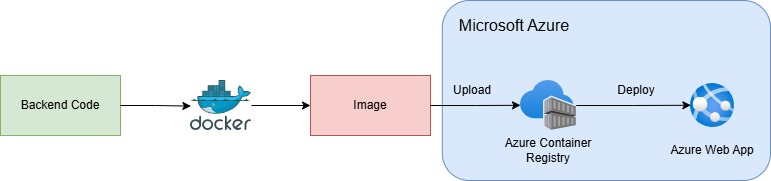
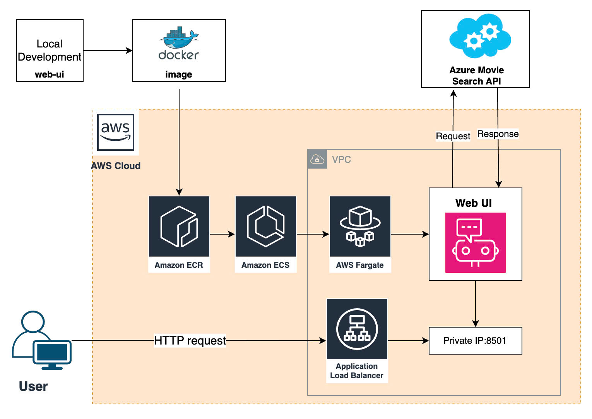

# 🎬 Ứng Dụng Gợi Ý Phim 🌟

## I. Giới Thiệu Dự Án 🧐

Dự án xây dựng một ứng dụng gợi ý phim thông minh, giúp người dùng tìm kiếm và nhận gợi ý phim dựa trên các truy vấn đầu vào. Dự án sử dụng các dịch vụ trên **Azure Cloud** và **AWS** để triển khai backend và frontend, giúp tối ưu hóa hiệu suất và khả năng mở rộng của ứng dụng.

Demo:
[Demo](demo_path.mp4)

### Các Cloud và Service Đã Dùng 🌐

| **Cloud Provider** | **Dịch Vụ Đã Dùng**                                                     | **Mô Tả**                                                           |
|--------------------|------------------------------------------------------------------------|---------------------------------------------------------------------|
| **Azure**          | Azure App Service                                                    | Triển khai backend, hỗ trợ quản lý ứng dụng và auto-scaling          |
|                    | Azure Container Registry                                                | Hỗ trợ lưu trữ các image cho Backend      |
|                    | Azure Search Service                                                       | Hỗ trợ về Vector Search, lưu trữ và tổ chức Database hiệu quả               |
|                    | Azure AI Service                                                       | Cung cấp các mô hình AI (LLM, Embedding) phục vụ xử lý các truy vấn từ người dùng.                  |
|                    | Azure Bing Search                                                       | Dịch vụ Web Search, tích hợp cùng các dịch vụ AI của Azure hỗ trợ tìm kiếm thông tin qua Bing.                  |
| **AWS**            | AWS ECR                                                            | Hỗ trợ lưu trữ các image cho Frontend       |
|                    | AWS ECS + Fargate                                                              | Hỗ trợ triển khai service Frontend                         |
|                    | AWS ELB                                                    | Tạo Load Balancer cho Web UI                                  |
|                    | AWS VPC                                                    | Thiết lập Network cho Web UI                                 |


### Thành Viên Dự Án 👩‍💻👨‍💻

- **Nguyễn Quốc Khánh**
- **Tần Lê Nghĩa**
- **Nguyễn Minh Dũng**
- **Trần Duy Kiên**
- **Nguyễn Ngọc Ánh**
- **Hoàng Thu Thuỷ**

---

## II. Kiến Trúc Dự Án 🏗️

### 1. Cấu Trúc Frontend & Backend 🔧

#### **Frontend**

- Ứng dụng được xây dựng với **StreamLit**, kết nối với backend qua API.
- **Frontend** hiển thị các gợi ý phim, cho phép người dùng nhập truy vấn và nhận kết quả từ hệ thống.


#### **Backend**

- Phần Backend được viết bằng **Python**, sử dụng **Fastapi** để xử lý các yêu cầu từ phần Frontend và các dịch vụ từ **Microsoft Azure**


---

### 2. Triển Khai Dự Án Lên Cloud ☁️

#### **Triển Khai Backend**

- Backend được triển khai lên **Azure App Service** thông qua **Azure Container Registry**.



#### **Triển Khai Frontend**

- Frontend được triển khai lên **AWS Lambda**, sử dụng dịch vụ **API Gateway** để phục vụ các API cho frontend.



---

## III. Hướng Dẫn Cài Đặt Repository ⚙️

### Các bước cài đặt ứng dụng

#### 1. Clone Repository

Clone repo từ GitHub về máy:

```bash
git clone https://github.com/khanhnguyenuet/movies-chatbot.git
cd movies-chatbot
```

#### 2. Build image và chạy với Docker

Cấu trúc dự án:

```bash
movies_cloud/
│
├── ui/                      # Thư mục Frontend
│   ├── Dockerfile           # Dockerfile cho UI
│   ├── README.md            
│   └── ...
│
├── app/                     # Thư mục Backend
│   ├── Dockerfile           # Dockerfile cho phần Backend
│   ├── README.md            
│   └── ...
│
└── docker-compose.yml
```

Trong mỗi folder ```ui``` (cho phần Frontend) và ```app``` (cho phần Backend) có Dockerfile để đóng gói mỗi phần. Để build image cho từng phần, chạy lệnh sau:

- Đối với Backend:

```bash
docker build -t movies_cloud ./app/
```

- Đối với Fontend:

```bash
docker build -t chat-ui-streamlit ./ui/
```

Để chạy Movie app với ```docker-compose``` chạy lệnh:

```bash
docker compose-up -d
```

Phần **Backend** sẽ chạy ở đường link ```http://localhost:8000/```, **Frontend** sẽ chạy ở đường link ```http://localhost:8501/```.
